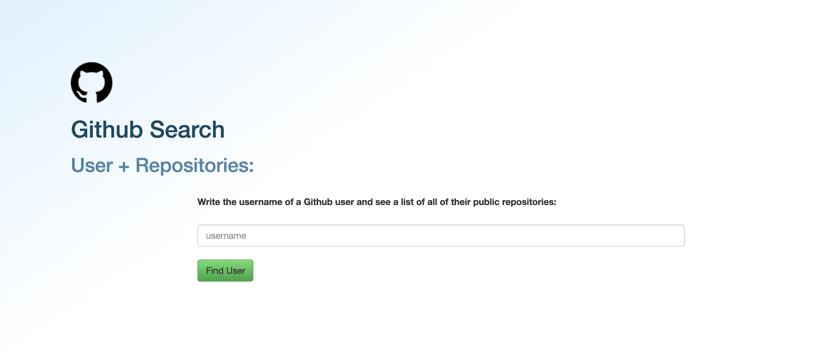

# _Github User Search_

#### _This application will allow you to enter in a username of anyone who is a member of Github and see the names and descriptions of her/his/their repositories(including the descriptions of the project), Oct, 14th, 2016_

#### By _**Kyle Lange**_

## Description

_This site should show my understanding of:_

* _using the Gulp asset pipeline_
* _managing build dependencies with npm_
* _managing front-end dependencies with Bower_
* _Have JS code that is front/back end seperate and connected with 'require'/'exports'_
* _Make request to (back-end) AJAX._
* _Uses Sass/Parses JSON to AJAX through a url + access key_
* _uses gulpfile.js (to run package dependencies), .gitignore (so temp files and build components do not upload to github), and .env (to store API key securely)_

## Setup/Installation Requirements

_Install GitHub Search locally by cloning this repository:

(https://github.com/kylelange/github-search.git)

_1. After cloning this repository, initialize and install the Node and Bower packages by running these commands in your terminal:_

  _$npm install_

  _$bower install_

_Look at the gulpfile.js in this repository to see the packages/dependencies installed through nmp/Bower and code that runs/pipes each package.  The most important package is gulp, which gathers all the others and later allows you to build and serve the site locally.  See more below._

_2. when installation is complete, enter the commands below in your terminal to use gulp to run the program locally in your server:_

  _$gulp build_

  _$gulp serve_

_3. You will need an API key from the [GitHub API](https://github.com/blog/1509-personal-api-tokens) to use this project. Create an .env folder in the TOP LEVEL of the project, and place your API access token in following code below:_

_exports.apiKey = "YOUR_APIKEY_HERE";_

_4.  you will need to create an .env file at the top level of this program. To hide your API key, place your .env file in your .gitignore file (which should also be in the top level)._

## Known Bugs

_{There are no known bugs at this time.}_

## Support and contact details

For questions, concerns, or suggestions please email baronsintrees@gmail.com

## Technologies Used

* _HTML_
* _CSS with Sass_
* _Javascript / JQuery_
* _Node.js with the Node Package Manager_
* _Bower_
* _Gulp_
* _Git, gitHub_

### License

Copyright (c) 2016 **_{Kyle Lange}_**

_This software is licensed under the MIT license._
